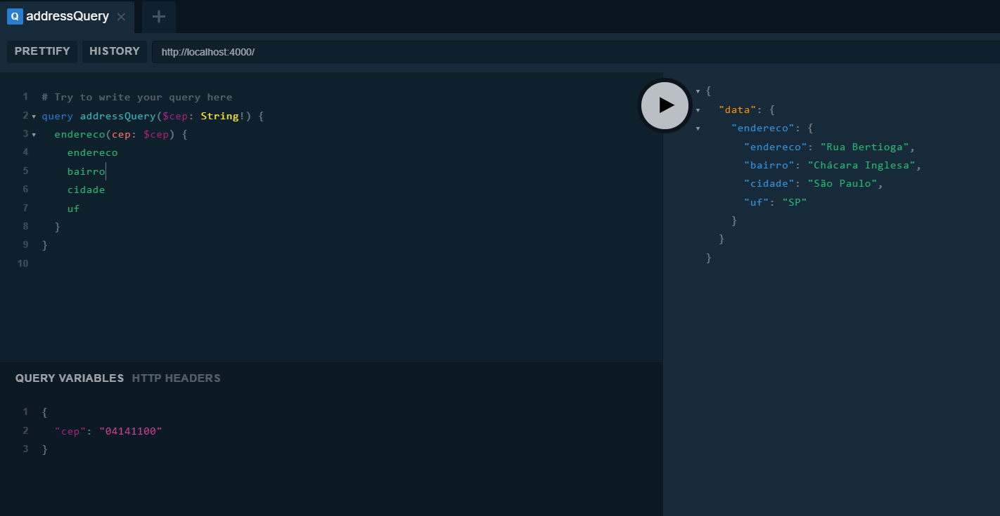

<h1 align="center">
  
</h1>

# cep-promise-graphql
API GraphlQL que disponibiliza uma Query (consulta de endereço via CEP). Consumindo API REST do [Cep-promise](https://github.com/BrasilAPI/cep-promise) (Busca por CEP integrado diretamente aos serviços dos Correios, ViaCEP e outros).

## Como baixar e rodar o projeto

```bash

  # Clonar repositório
  $ git clone https://github.com/morganOliveira2018/cep-promise-graphql

  # Entrar no diretório
  $ cd cep-promise-graphql

  # Instalar dependências
  $ yarn install

  # Iniciar o projeto
  $ yarn start

```

## Exemplo de consulta

```graphql

# Acessar o browser
  http://localhost:4000/

query addressQuery($cep: String!) {
  endereco(cep: $cep) {
    endereco
    bairro
    cidade
    uf
  }
}

QUERY VARIABLES:
{
  "cep": "04141100" 
}

```
